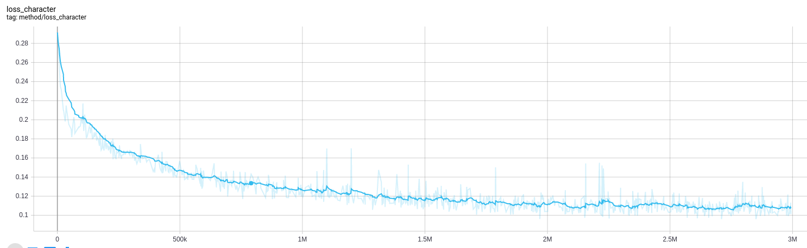
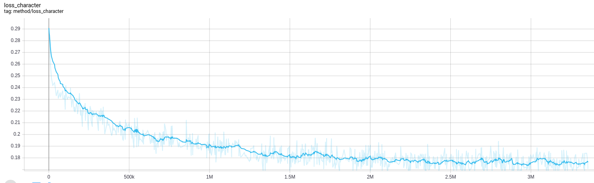
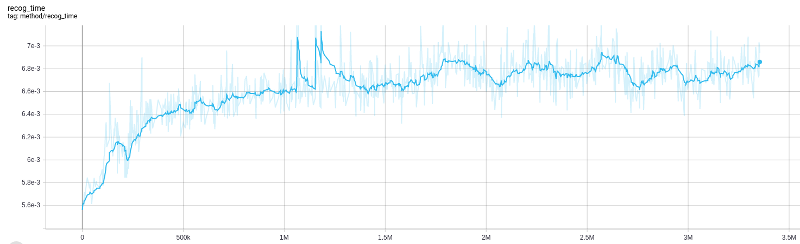
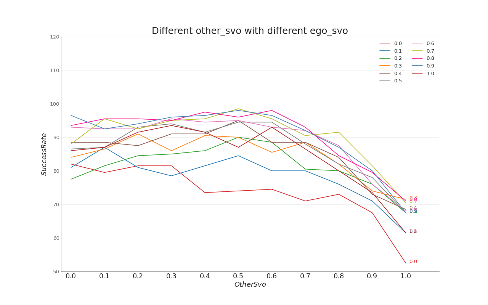

# recognition-rl

## 2022/12

### 1.排除horizon带来的问题：

horizon = 30 action_horizon = 10

```bash
(Pdb) state_.ego.shape
torch.Size([1, 30, 5])
(Pdb) state_.ego[...,-1]
tensor([[-0.966667, -0.933333, -0.900000, -0.866667, -0.833333, -0.800000, -0.766667, -0.733333, -0.700000, -0.666667, -0.633333, -0.600000, -0.566667, -0.533333, -0.500000, -0.466667, -0.433333, -0.400000, -0.366667, -0.333333, -0.300000, -0.266667, -0.233333, -0.200000, -0.166667, -0.133333, -0.100000, -0.066667, -0.033333, -0.000000]], device='cuda:0')

经过操作：(state_.ego = state_.ego[:,-horizon:,:])
(Pdb) state_.ego[...,-1]
tensor([[-0.300000, -0.266667, -0.233333, -0.200000, -0.166667, -0.133333, -0.100000, -0.066667, -0.033333, -0.000000]], device='cuda:0')

经过操作：（state_.ego[...,-1] = state_.ego[...,-1]*30/horizon）
(Pdb) state_.ego[...,-1]
tensor([[-0.900000, -0.800000, -0.700000, -0.600000, -0.500000, -0.400000, -0.300000, -0.200000, -0.100000, -0.000000]], device='cuda:0')
完成对齐
```

### 2.测试内存消耗，以及确定buffersize

目前监督学习的buffersize设置为130000

> 测试监督学习的内存消耗
>
> 1.测试horizon为30
>
> supervise buffersize  =  10000  horizon = 30  num_workers = 10->  43.2G cpu
>
> supervise buffersize  =  20000  horizon = 30 num_workers = 10 -> 44.4G cpu 
>
> supervise buffersize = 130000(max)  horizon = 30 num_workers = 10 -> 58.2G cpu 
>
> （结论：是horizon 为30的话10000消耗1.2G左右 ）
>
> 2.测试horizon为10
>
> supervise buffersize = 10000  horizon = 10 num_workers = 10 -> 43.0G cpu 
>
> supervise buffersize = 30000  horizon = 10 num_workers = 10 -> 45.2G cpu 
>
> supervise buffersize = 80000  horizon = 10 num_workers = 10 -> 50.4G cpu 
>
> （结论：是horizon 为30的话10000消耗1.05G左右 ）
>
> 3.测试一个worker加载训练的模型要多大
>
> supervise buffersize = 10000  horizon = 10 num_workers = 11 ->  cpu 

> 测试RL的内存消耗
>
> rl-recog buffersize  =  10000  horizon = 30  num_workers = 10->   cpu
>
> rl-recog buffersize  =  20000  horizon = 30 num_workers = 10 -> G cpu 
>
> rl-recog buffersize = 10000  horizon = 10 num_workers = 10 -> G cpu 
>
> rl-recog buffersize = 10000  horizon = 10 num_workers = 11 -> G cpu 

### 3.horizon的改变带来的对比

位置： ~/github/zdk/recognition-rl/results/IndependentSACsupervise-EnvInteractiveSingleAgent

（1）**horizon为30：2022-11-26-12:32:44----Nothing--supervise-hrz30-act10**



验证精度：见MIner/11-29文件夹

（2）**horizon为10：2022-11-30-15:05:17----Nothing--supervise-hrz10-act10**





| 序号 | character_loss | recognition time |
| ---- | -------------- | ---------------- |
|      |                |                  |
|      |                |                  |
|      |                |                  |


### 4.Without attention性能对比

### 5.将历史轨迹进行降采样

### 6.下层action改为1

并且写一个 单独的master

### 7.论文阅读继续

8.2022/12/22

离线数据生成已搞定，下面跑一下之前的结果，rl的buffersize尽量能够大一些

重新把other svo变动和自车svo变动结果跑一遍，迁移到3060上训练

看一篇论文

2022/12/23发现加入训练成功率较低，打算接一个模型看看可视化结果，（已解决，down sample interval = 4时训练性能下降）

2022/12/26打算重新跑一遍rl，和监督学习，先跑rl，再跑监督。确定rl需要的buffersize是多少，然后用对应的监督学习去做对比




以上图的结果符合预期（数据来源12-27fixsvo)


验证hr=1的MARL的isac的测试性能：

不同的电脑上：

> 12-27fixsvo_from127对比发现在不同的电脑上验证结果会不一样

修改ScenarioBottleneckEvaluate_without_mismatch的ego svo 为0.7试试，看看和ego_svo为0之间的区别，看看性能差距是否很大？

> 12-27-isac-background发现有差距，但是还是定为0

验证MARL的isac(不进行downsample训练好)在downsample的验证测试性能：

> duplicity-rarl/results/Mine/12-27-isac-background
>
> 结论是发现性能有所下降：

训练recog + rl + downsample：

> 2022-12-26-22:01:02----Nothing--isac_recog__downsample_new_adaptive
>
> 验证downsample+rl+buffersize=300000的结果：


12/28继续验证recog + rl + downsample+buffersize = 300000能不能训练出来

> 可以训出来

监督学习也可以开始，问问堃哥那个内存的事情，尽快把内存条加到3060上


关于写论文：

为什么要做性格辨识，是不是idm模型加入svo这个概念会性能更好？

验证两件事情：

> 1.idm背景引入svo 2.recog 结构引入随机生成svo看看性能有无变化  

1.核心思想是用rl+recognition的方式去做性格辨识，有点就在于性能好，且比基于监督学习的性能好。

2.要不要和online learning作对比(回看一些论文，包括lv chen的那一篇）

3.之前的一些东西可否直接拿过来用？

4.继续调研看论文

> 读了meta learning那一篇论文后，核心就是分两步训练，先去训练扰动函数
>
> 要不要动Actor的参数，进行两步训练结构（能不能叫做meta-learning？）
>
> 要不要修改loss函数，改为reward base的


control oriented meta learning这篇论文交流

1.搞清基本思路 2.类比咱们的方法 3.梯度反传

理论支撑的点就在于虽然参数不准确但是性能可以

这篇论文以及meta learning带来的启发

咱们的方法要是效仿meta learning的话那就是

2.rl 的loss是否要做改变？变成expec cumulative reward

3.我打算做几个实验，一个是随机生成svo给actor，一个是idm做辨识


2022/12/30

验证发现new adaptive的性能在87.5， 加入recg性能下降为84.5. 下降三个点。

待验证：随机svo